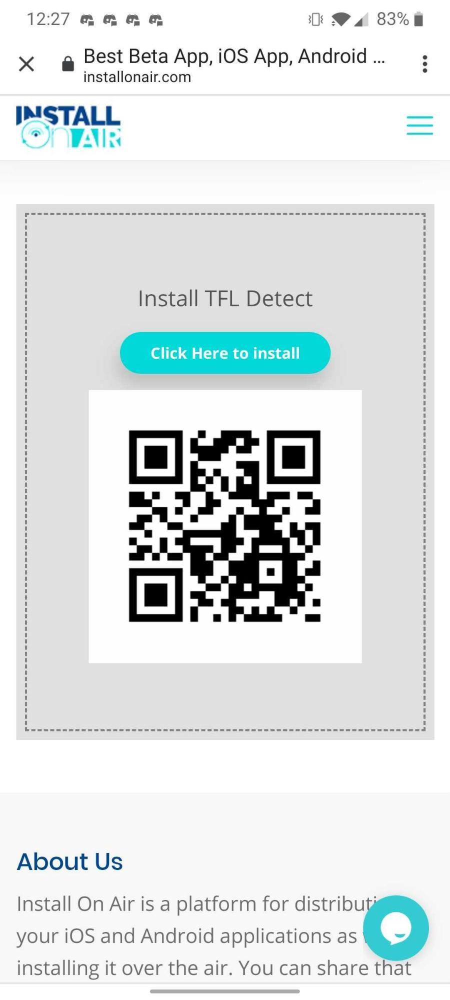
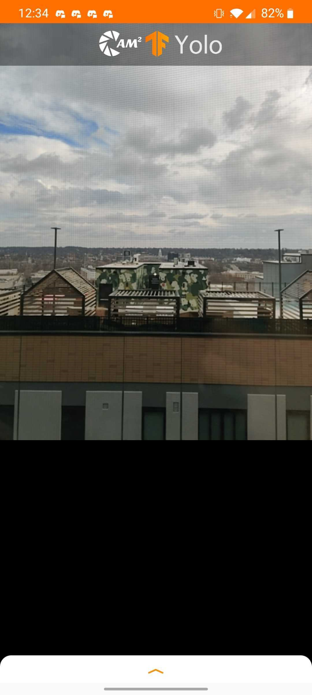
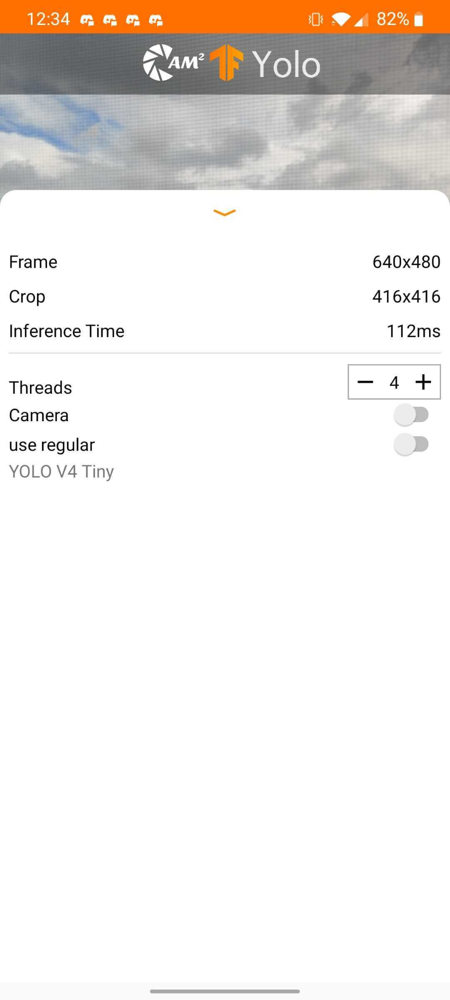

# Android Installation:

1. Go to the following link: [cam2project.net/yolo](https://cam2project.net/yolo)
2. It will take you to this page:

3. Click “Click Here to install”
4. Follow the installation instructions, Google’s play protect might send a warning, if that happens, click “install anyway”
5. This is what the installed app looks like:

6. This is what the app looks like when you open it, it uses the external camera as the default camera and YOLO V4 tiny as the default detector

7. Bottom sheet:

Threads: Number of Threads used for the detector (0 - 9)

Camera: External Camera if switched off, else front facing camera

Use regular: if switched off, the detection will be done with YOLO V4 tiny, else YOLO v3

Description: a brief description of the model being used (work in progress)
