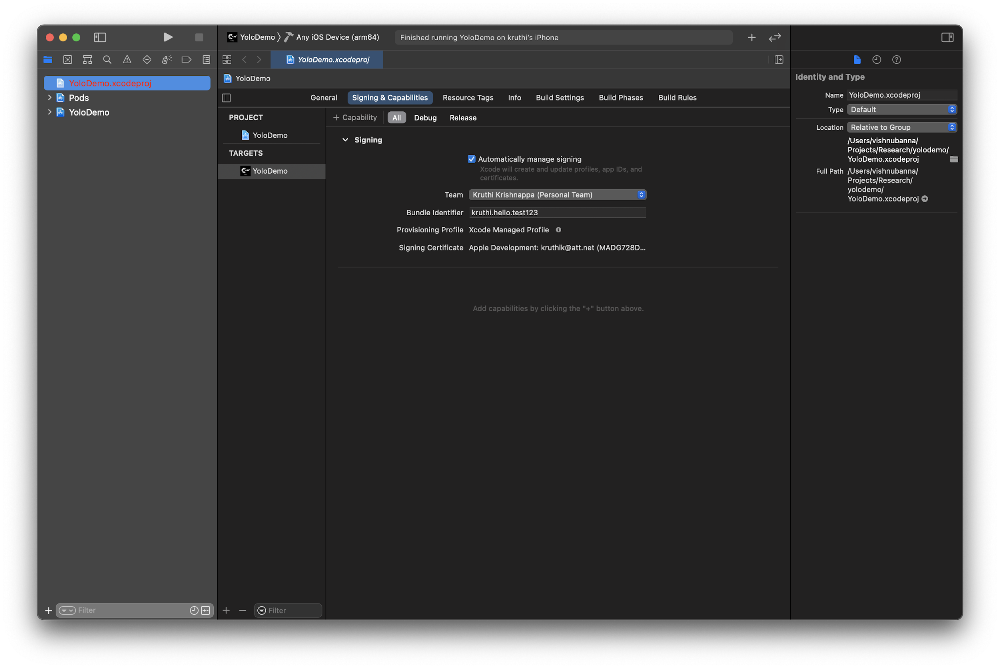

**iOS build Instructions (requires a Mac)**


1. Go to the Mac App Store and install Xcode (1-2 hours, just leave computer on, Mac should have latest update)
2. In terminal, install cocoa pods using the command: ```sudo gem install cocoapods``` (5-10 minutes)
3. Unzip the file yolodemo.zip to a location that is accessible via your terminal (suggested: desktop, 1 minute)
4. Via terminal go to the unzipped yolodemo folder
5. Install all coco pods by using the command ```pod update``` (1 minute)
    1. If some error occurs, try command ```pod install```
6. Go to the unzipped yolodemo folder using finder
7. Double click YoloDemo.xcworkspace to open the code in Xcode
8. Now click YoloDemo > signing&capabilities in Xcode



    1. Select a development team (this may require you signing into your Apple ID)


    2. If a Bundle identifier error shows up, go to YoloDemo > signing&capabilities, and change the bundle identifier name to something unique, (something random like: &lt;yourname>.helloe.test)
9. Plug your phone into the computer, make sure it can be accessed via finder then Return to the YoloDemo in Xcode
10. Save the project once (cmnd-s)
11. On the top left corner next to the buttons to exit the Xcode app there is a  triangle (run), a square (stop), and a label that says YoloDemo>(an iOS device)
    1. Click on the the item with (an iOS device), and scroll all the way to the top. The very first entry should be your iOS device


  2. Select this device and click the triangle (run) to build and install the app on your device


12. You will get an error saying the app could not be opened, you can ignore this.
13. Once installed on your iOS device, go to iOS settings > general > Device Management > Apple Development:…  and trust the developer
14. Once that is complete, you can open the app labeled CAM2 Yolo Demo, and run the demo

Suggested to run at 2 - 3 threads.
