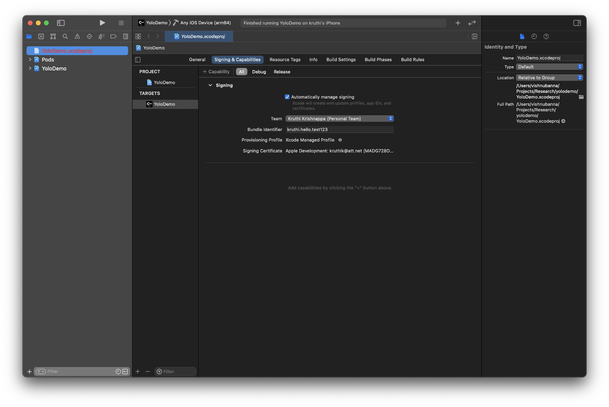
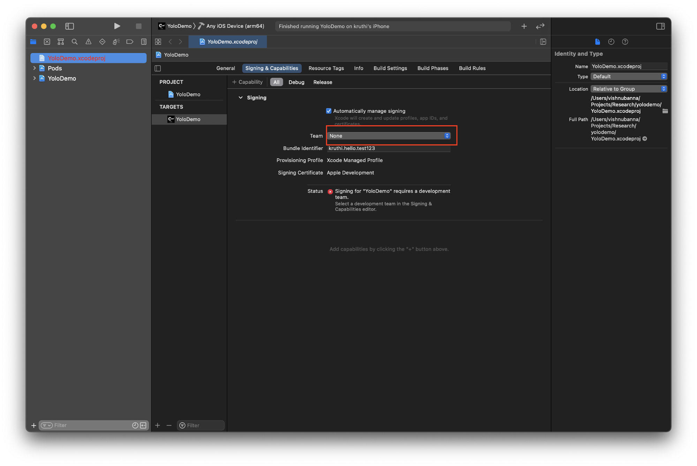
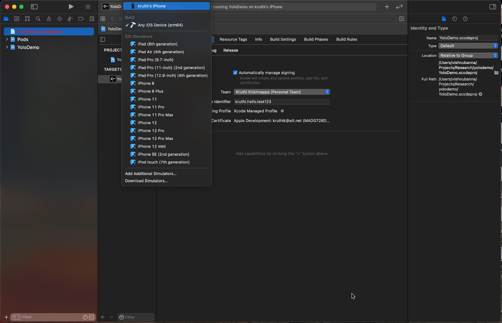
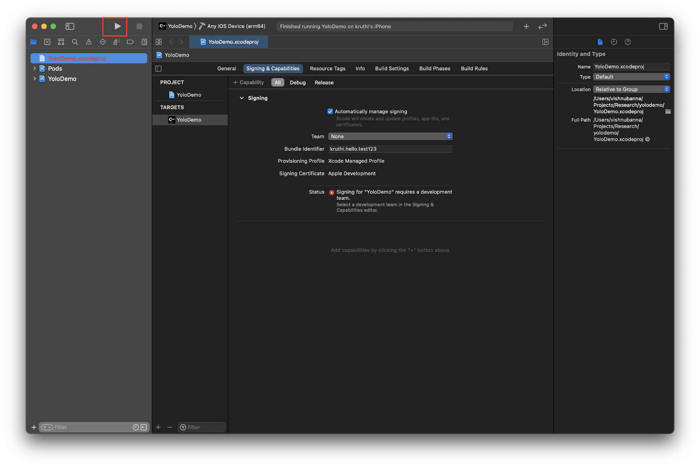

**iOS build Instructions (requires a Mac)**


1. Go to the Mac App Store and install Xcode (1-2 hours, just leave computer on, Mac should have latest update)
2. To install CocoaPods on your system, open the Terminal and run the command: ```sudo gem install cocoapods``` (5-10 minutes)

   If you are using an older version of MacOS (Catalina or older), you may need to install Ruby first if it isn't already installed. If you want to install CocoaPods to your user instead of your system, you can also use the following instructions for Big Sur. The following instructions are adapted from [a GitHub issue](https://github.com/orta/cocoapods-keys/issues/198#issuecomment-510909030).
   1. Open the Terminal and install [HomeBrew](https://brew.sh/) by running the command ```/bin/bash -c "$(curl -fsSL https://raw.githubusercontent.com/Homebrew/install/HEAD/install.sh)"```.
   2. Run the command ```brew install rbenv ruby-build```
   3. Run ```rbenv init```
   4. Follow the installation instructions for your shell given by the output of the previous command to load RBEnv every time your shell starts. This may require opening an invisible file in your home directory using your text editor. To do this, just run the name of your editor as a command followed by the name of the file that RBEnv wants to change. For example: ```atom ~/.bash_profile```. Remember to append the line given by ```rbenv init``` to the end of the file instead of replacing the whole file. Also remember to save and close the file when you are done editing.
   5. Run ```rbenv install 2.6.3``` (newer versions may work, but are untested)
   6. Run ```rbenv global 2.6.3```
   7. Run ```which gem``` to verify that Ruby was set up correctly. If it doesnt report ```/Users/<youruser>/.rbenv/shims/gem``` then restart your terminal.
   8. Run ```ruby -v``` to check if Ruby updated
   9. Run ```gem install cocoapods``` to finally install CocaPods
3. ```cd``` to this directory and install all coco pods by using the command ```pod install``` (1 minute)
4. Go to the unzipped yolodemo folder using finder
5. Double click YoloDemo.xcworkspace to open the code in Xcode
6. Now click YoloDemo > signing&capabilities in Xcode
   

   1. Select a development team (this may require you signing into your Apple ID)
   

   2. If a Bundle identifier error shows up, go to YoloDemo > signing&capabilities, and change the bundle identifier name to something unique, (something random like: &lt;yourname>.helloe.test)
7. Plug your phone into the computer, make sure it can be accessed via finder then Return to the YoloDemo in Xcode
8. Save the project once (cmnd-s)
9. On the top left corner next to the buttons to exit the Xcode app there is a  triangle (run), a square (stop), and a label that says YoloDemo>(an iOS device)
    1. Click on the the item with (an iOS device), and scroll all the way to the top. The very first entry should be your iOS device
    

    2. Select this device and click the triangle (run) to build and install the app on your device
    


10. You will get an error saying the app could not be opened, you can ignore this.
11. Once installed on your iOS device, go to iOS settings > general > Device Management > Apple Development:…  and trust the developer
12. Once that is complete, you can open the app labeled CAM2 Yolo Demo, and run the demo

Suggested to run at 2 - 3 threads.
